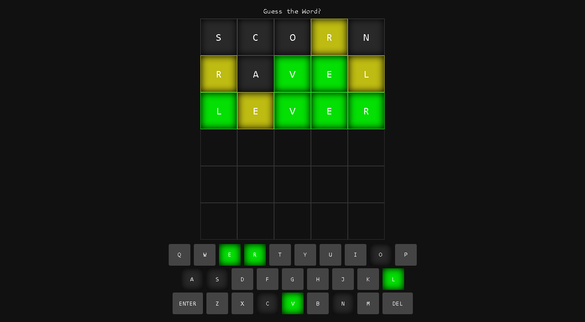

# guess-the-word

A wordle clone made with HTML, CSS, and Javascript.

## Demo

[Live Preview](https://nevz9.github.io/guess-the-word/)

## Screenshots

## Optimizations

- Completely new code from the old one
- Implemented eslint, editorconfig, and prettier, for finding errors and consistent code style
- Integrated webpack
- Changed the UI
- Made variables, functions, etc easier to read (hopefully, need to work on my naming)

## Lessons Learned

Making use of the single responsibility principle. I learned how to spot code duplications, which was what I struggled the most with all the projects I've done so far. I'm still not fully confident but I will keep learning more about this.

## Acknowledgements

- [Official Wordle Website](https://www.nytimes.com/games/wordle/index.html)
- [Word list that I took from](https://gist.github.com/cfreshman/a03ef2cba789d8cf00c08f767e0fad7b)
